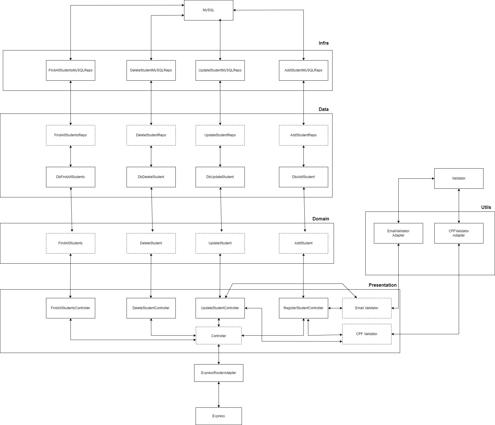

# CRUD Students - API/NodeJS
#### API para a aplicação de registro de alunos com NodeJS/Typescript, Express, MySQL, Sequelize e Arquitetura em camadas.


## Project setup
```
npm install
```
```
Rename .env.example to .env and set the database information
```

### Run Migrarions
```
npx sequelize-cli db:migrate
```

### Run Server
```
npm run start
```

### Run your unit tests
```
npm run test
```
